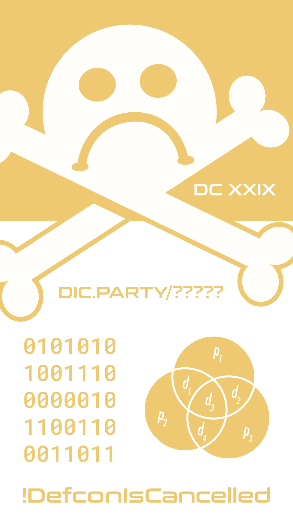
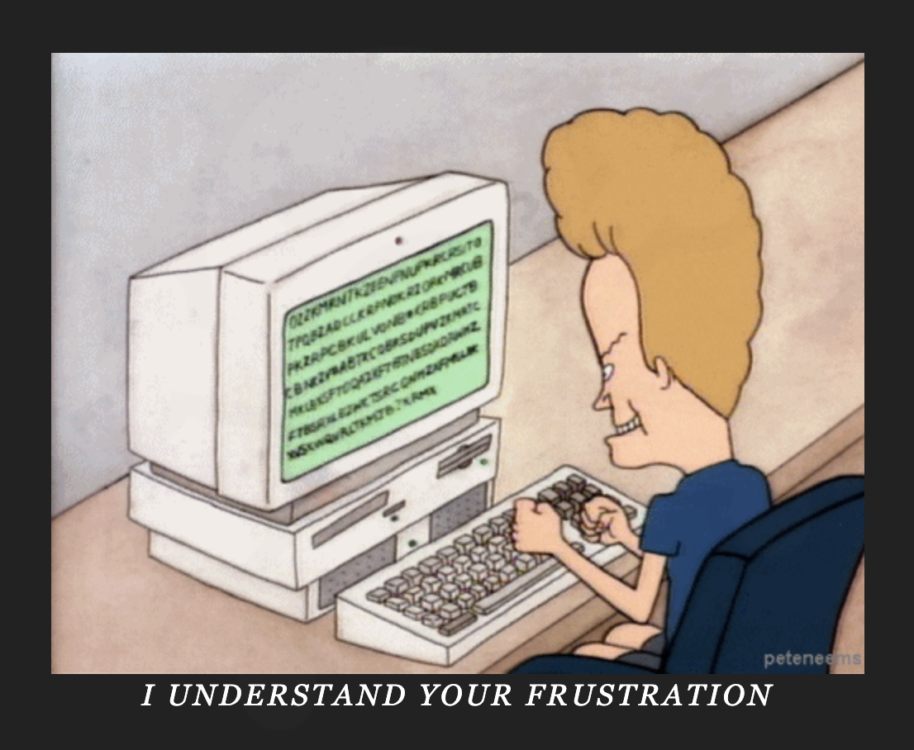
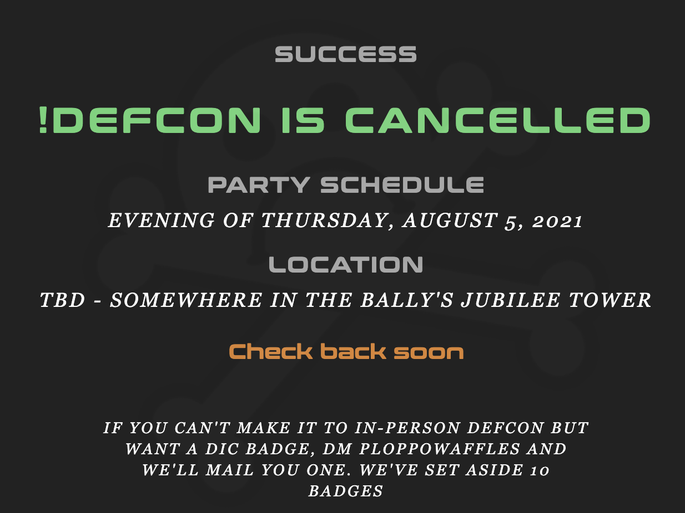

# Defcon Is Canceled
https://www.dic.party/




A Google search turned up the tri-vendiagram is [Hammings (7,4) algorithm](https://en.wikipedia.org/wiki/Hamming(7,4))
Grabbing the code from the image and throwing it into a [Hammings Error-Correcting Code](https://www.dcode.fr/hamming-error-correction)

```binary
0101010 1001110 0000010 1100110 0011011
```
Output:
```
0010 0100 0000 0110 1001
```

We are dealing with binary so put it into a [blanket converter](https://www.rapidtables.com/convert/number/ascii-hex-bin-dec-converter.html) Of the various outputs the decimal output is a 5 digit as the challenege requests:`24069` --> https://www.dic.party/24069/

However this is not the solution we want.



Revisiting the Hammings code we can see the `d3` and `d4` values have been swapped on the challenege


Hamming's code is represented bit positions and parity of their positions. Of the 7 binary positions correspond to the bit numbers in binary:

| 1 | 2 | 3 | 4 | 5 | 6 | 7 |
| -- | -- | -- | -- | -- | -- | -- |
| 1 | 10 | 11 | 100 | 101 | 110 | 111 |

- Parity bits are those with the power of two:
`1,2,4`
- The data bits are all other bits, with two or more 1 bits. `3,5,6,7`

From this we can devise

| 1 | 2 | 3 | 4 | 5 | 6 | 7 |
| -- | -- | -- | -- | -- | -- | -- |
| p<sub>1</sub> | p<sub>2</sub> | d<sub>1</sub> | p<sub>3</sub>| d<sub>2</sub> | d<sub>3</sub> | d<sub>4</sub> |

Using this formula we will extract the just the data bits. However d<sub>3</sub> and d<sub>4</sub> are swapped. This makes things even more complex with the fact that the middle number is swapped. Basically making this even more complex.

| p<sub>1</sub> | p<sub>2</sub> | d<sub>1</sub> | p<sub>3</sub>| d<sub>2</sub> | d<sub>3</sub> | d<sub>4</sub> |
| -- | -- | -- | -- | -- | -- | -- |
| 0 | 1 | 0 | 1 | 0 | 1 | 0 |
| 1 | 0 | 0 | 1 | 1 | 1 | 0 |
| 0 | 0 | 0 | 0 | 0 | 1 | 0 |
| 1 | 1 | 0 | 0 | 1 | 1 | 0 |
| 0 | 0 | 1 | 1 | 0 | 1 | 1 |

After looking over the previous soltion you will see that you can make the number, `420`,`69` which is the solve. Revering this will lead us to this binary formula.

`42069` --> `0100 0010 0000 0110 1001` --> `1001100 0101010 0000000 1100110 0011001`

Looking at the above chart you can see that p<sub>1</sub> and p<sub>2</sub> are swapped, not d<sub>3</sub> and d<sub>4</sub>.

Leading to --> <blockquote class="twitter-tweet"><p lang="en" dir="ltr">Spent the day reading papers and rabbit hole of wiki articles going into the deep math of how Hamming Error-Correcting Code works for <a href="https://twitter.com/hashtag/DefconIsCancelled?src=hash&amp;ref_src=twsrc%5Etfw">#DefconIsCancelled</a> challenge only to find that its a simple switch of numbers to make a funny number. I learned a lot,but goddamnit <a href="https://twitter.com/ploppowaffles?ref_src=twsrc%5Etfw">@ploppowaffles</a> <a href="https://t.co/hhSMKhwtSW">pic.twitter.com/hhSMKhwtSW</a></p>&mdash; devoops (@devoopes) <a href="https://twitter.com/devoopes/status/1422799627003174914?ref_src=twsrc%5Etfw">August 4, 2021</a></blockquote> <script async src="https://platform.twitter.com/widgets.js" charset="utf-8"></script>


#### Solution:

https://www.dic.party/42069/




#### Great Sources:
- https://en.bitcoinwiki.org/wiki/Hamming_code
- https://www.gaussianwaves.com/2008/05/hamming-codes-how-it-works/
- https://www.youtube.com/watch?v=2BI7wvmdFE8
- https://michaeldipperstein.github.io/hamming.html
