# 2023 [LayerOne](https://www.layerone.org/) Inercept Hardware CTF Challenge
- The Legend of LayerOne, A Link to the Hax

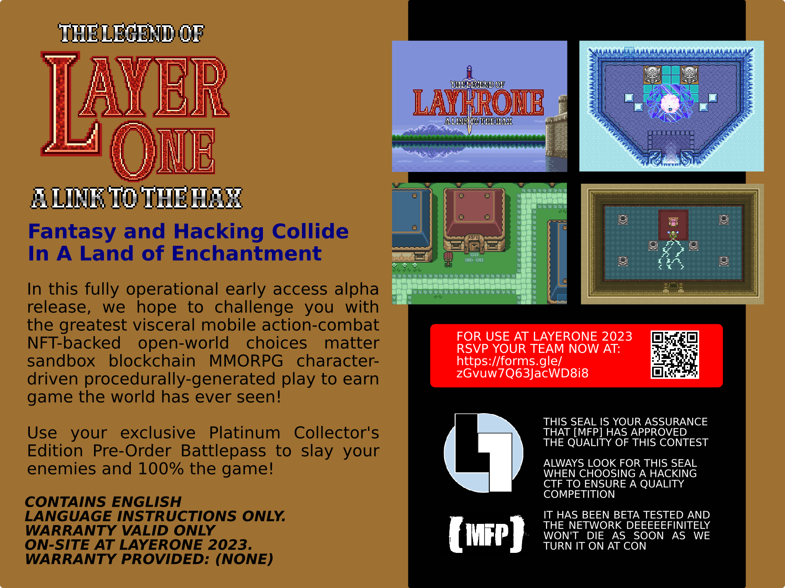

This year's Intercept put on by Datagram, [Joe Rozner](https://twitter.com/jrozner), and jk along with several play testers and helpers. Was designed around a custom PCB running an ESP with a screen inside a Gameboy Advance shell. This was then connected to a game server over wifi where players could explore the world together or try to kill one another. Overall design was loosely based off the Zelda, Link to the past Gameboy game. There were hardware, software, network and game challenges in the world and gaming device. Batteries not included. (You had to use power over USB)

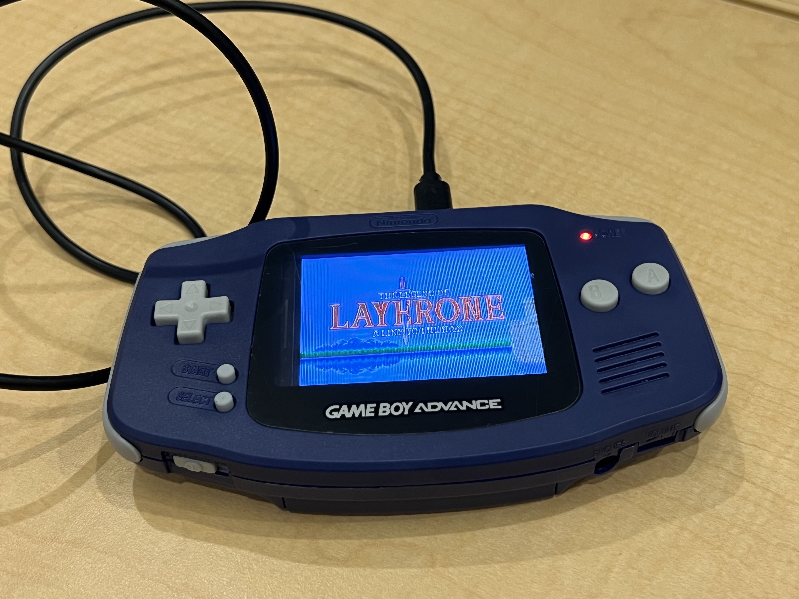
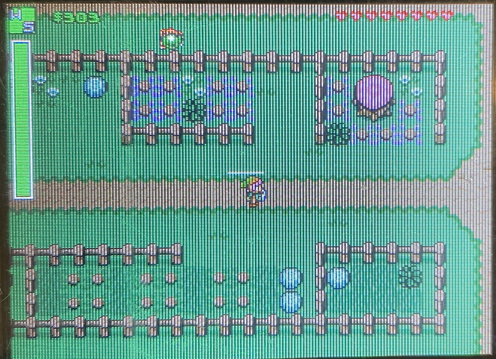
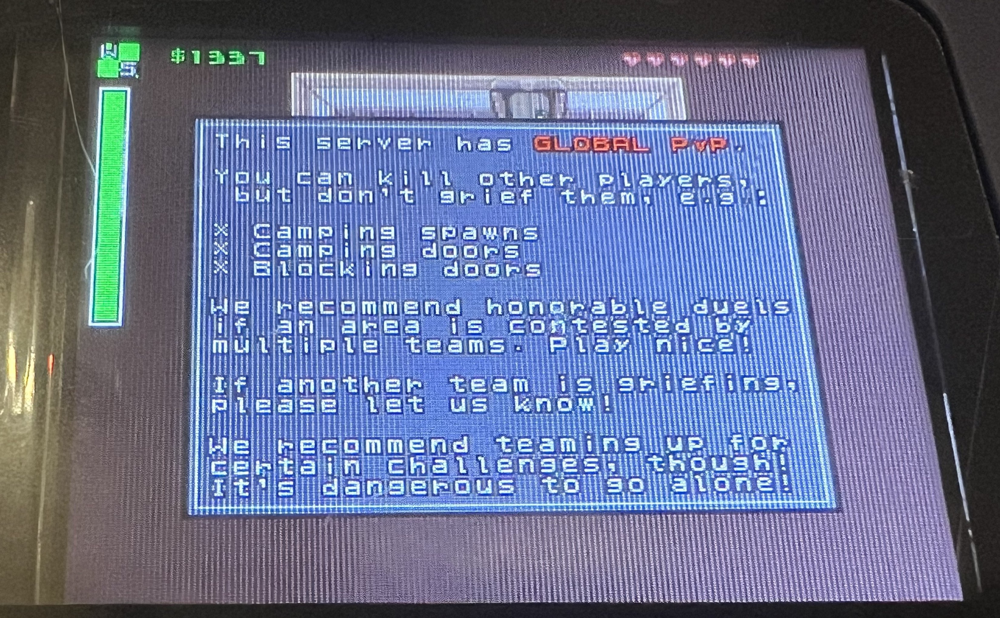


Our team consisted of the local [DC818](https://dc818.org/)
- babint
- devx00
- blinkingthing
- Dank
- [devoopes](https://github.com/devoopes/)
- TheGrandPackard
- Sage
- 536F4u1t
- SickPea
- [wasabi](https://twitter.com/spiceywasabi)

Our team score at the end of the game.
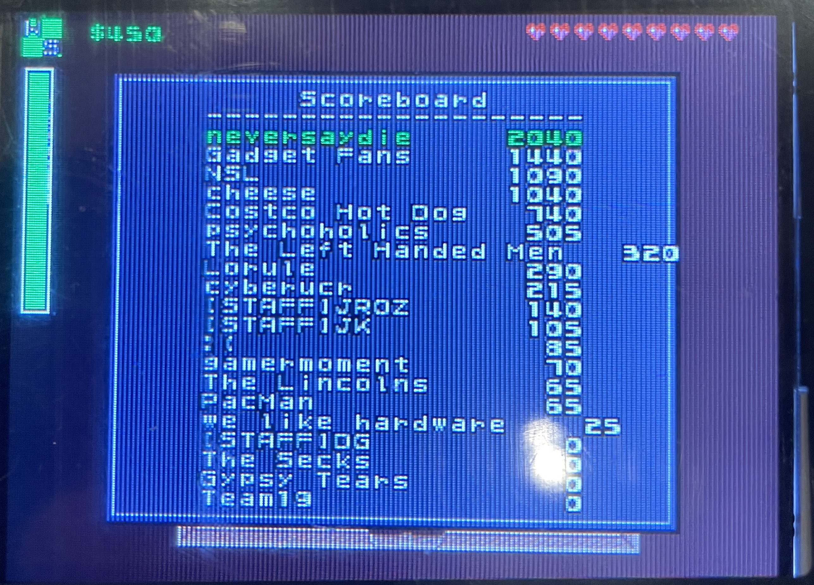
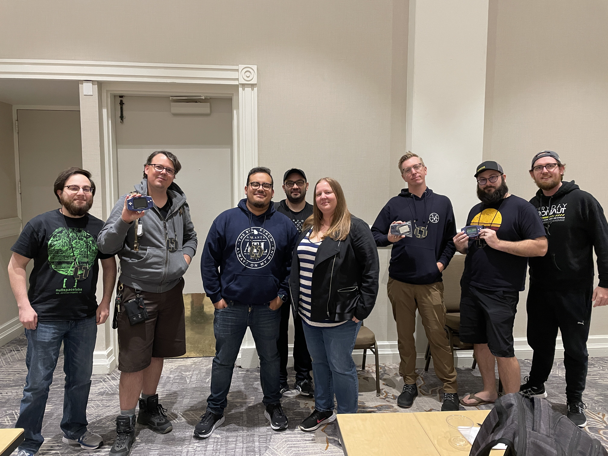


Challenges were listed in the in game menu, but the first thing we did was take the device apart which netted us our first flag. We then attached wires for UART and started to work on the rest. 

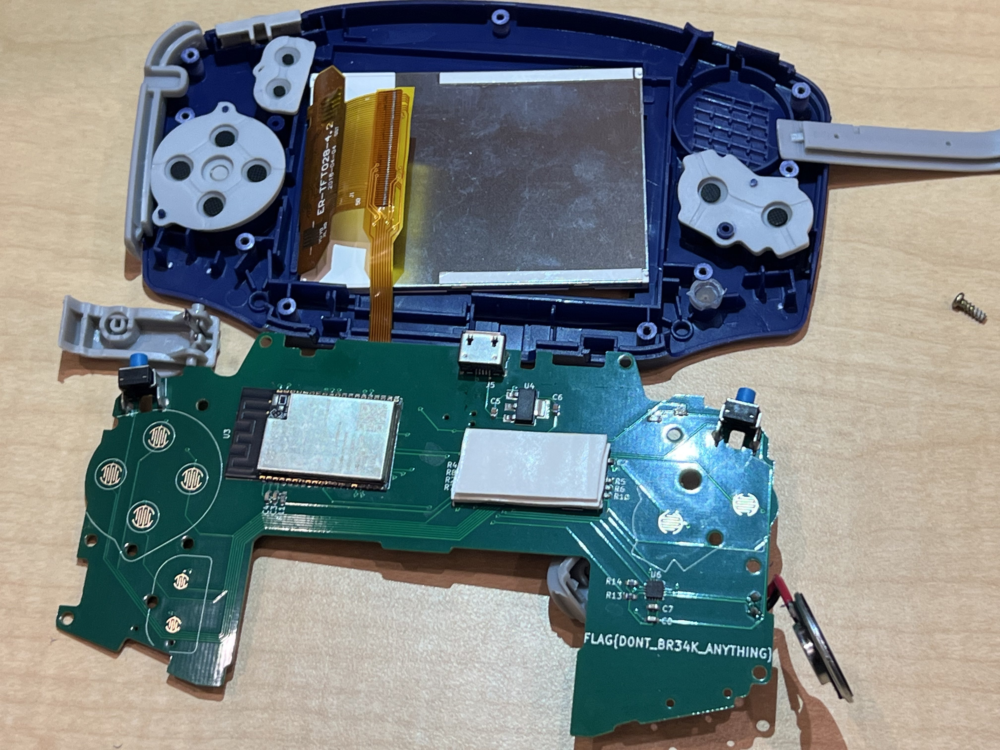
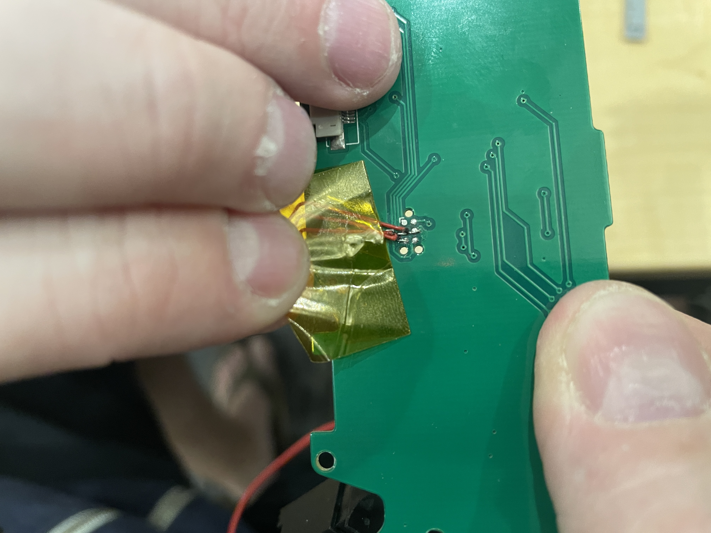


Once we got up and running we were able to capture and document all the challenges in a [spreadsheet](https://docs.google.com/spreadsheets/d/1SsAKzw9rl09uj6gT0g5-5xxn3X7XCy7v1EsPyviYCmM/edit?usp=sharing) as having over 40 challenges and who was working on what quickly got out of scope. 


**Handle It it** 
> 25 Points - I don't have an identity until I have a handle

In game, make your way to reg and get a badge. You can then register with a playername on the server and the flag is then rewarded in game with bottom of the screen text. Equipping the badge to a button then allows you to warp to spawn upon press. Spawn being the only safe place from PVP on the server. 

**The Wand of Odin** 
> 25 Points - Find the Staff of the Magi in the Caves

This is your first adventure. If you head north from the starting village you will find a cave with a NPC asking for you to help them find wizard staff. Upon finding him he will grant you a sword and shield. At the end of the very short dungeon. The staff allows you to cast magic spells when mapped to a key.

**Rescue Dog & Stray Cat** 
> 10 Points - Swiss the Magic Rabbit has a dog for you
> 10 Points - Swiss the Magic Rabbit has a cat for you

In town upon speaking to the innkeeper he will ask you to pick dog or cat. You can repeat the interaction to get both flags. 


**Gran Torino** 
> 50 Points - What was it like to kill a man?

You get this after killing your first player. I chose to kill my friend [krux](https://twitter.com/krux)

**My Name is My Name** 
> 150 Points - Goons can be identified by lowercase nametags

You can drop the badge at any time and get a new one. 

**OSINT Flags** 
> 50 Points - Riverside got this flag on the CTF black market

You can buy this flag for in game currency at the in game store. 

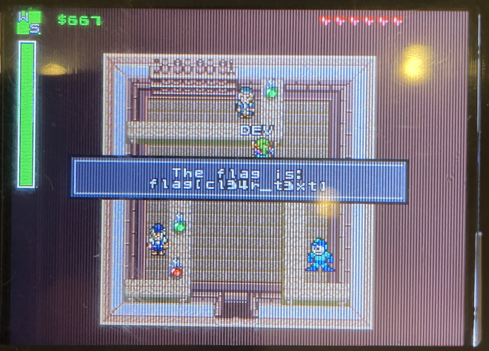

**Warranty Violation**
> 50 Points - Who needs a warranty anyways

Printed on the circuit board when the device is apart.

`FLAG{D0NT_BR34K_ANYTHING}`

**Dear Diary**
> 150 Points - Find the diary left behind by the angry developer

In the firmware dump we found a git repo in a .tgz In this there were logs and one of the logs contained the flag. 


`flag[d1sgruntl3d_y0]`

**Throw Your Hood Up**
> 100 Points - The server will award you a flag - but only if you send it a specific command


**Born To Kill**
>20 Points - Get 5 monster kills using any melee weapon

Easily achieved in the first few minutes of playing. 

**Animal Mother**
>200 Points - Get 500 monster kills using any melee weapon

Running around killing everything. 

**Earner**
> 100 Points - Get 200 gold

Again this was easily achieved in the first few minutes of playing. 

**Two Comma Club**
>500 Points - Get to 1 million gold

**Reckless Sorcerer**
> 150 Points - Cast 5 different spells in 5 seconds or less

**Locks You Own**
> 200 Points - Scorche has a secret in the middle of his talk

On the hour, every hour you could get into this room. We ended up recording the talk for an hour on my phone. Then playing the video back at 2x to watch for the flag. The talk can be found [here](https://youtu.be/SJ5n_k8A3vI).

`FLAG[R3SPONSIBL3_BURGL4R]`

**Any Technical Talks?**
> 500 Points - ChrisB2B is giving a great technical talk

This was another talk but it was given in all HEX. We hooked up UART and recorded the output but the output never ended up outputting the right info. 

```
decrypted B2B: 37 7a bc af 27 1c 00 04 94 96
decrypted B2B: 7f 91 60 07 00 00 00 00 00 00
decrypted B2B: 52 00 00 00 00 00 00 00 28 ed
decrypted B2B: 76 4a e0 38 1f 07 58 5d 00 3f
decrypted B2B: 91 45 84 68 3d 89 a6 da 8a e1
decrypted B2B: 83 32 4e d9 06 ea f9 f7 be 20
```

After running diff on a few outputs we found the error in our ways and were able to put the 7 zip back together to get the flag!

`flag!HS45UGood`


**Morfrir's Riddle 1**
> 100 Points - Find and defeat Morfrir's first lost puzzle

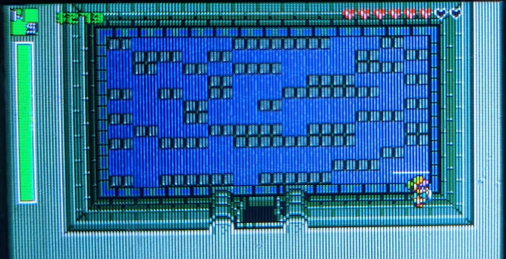

**Morfrir's Riddle 2**
> 150 Points - Find and defeat Morfrir's second lost puzzle

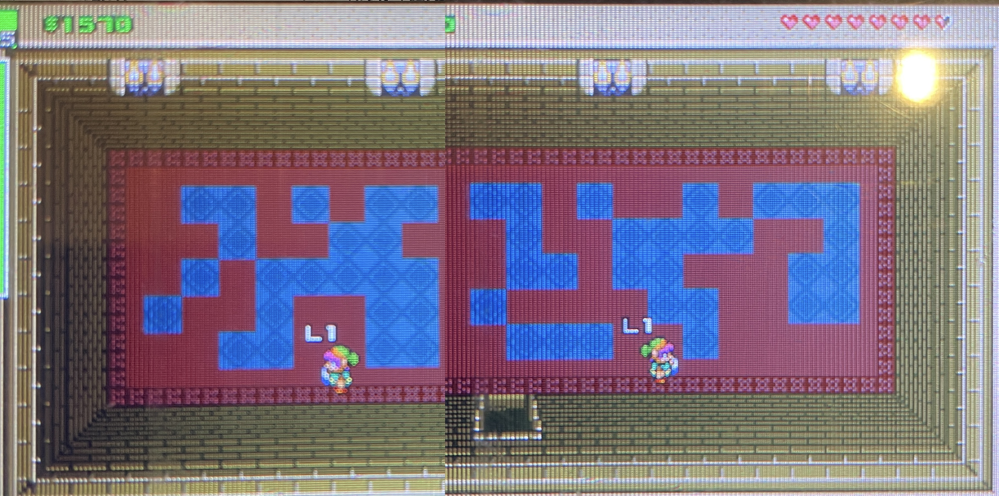

**Morfrir's Riddle 3**
> 200 Points - Find and defeat Morfrir's third lost puzzle

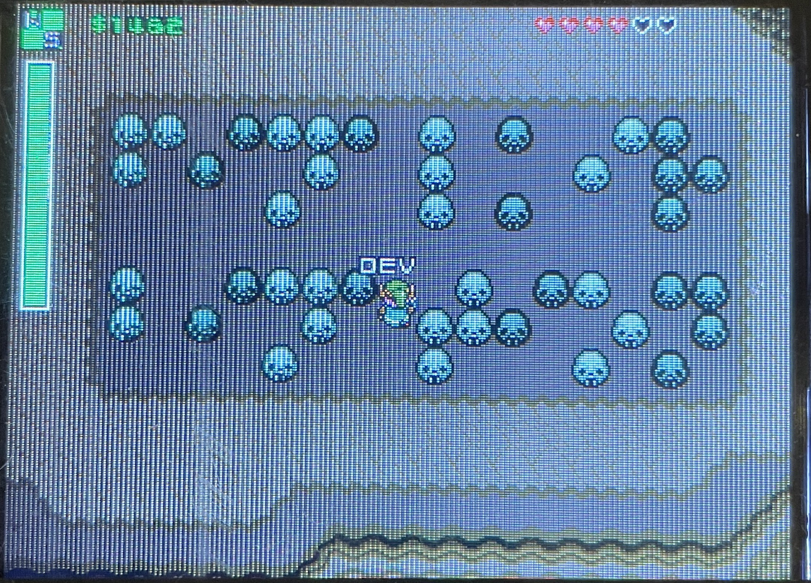

Which translated from [Braille](https://www.perkins.org/wp-content/uploads/2021/01/Braille_alphabet_feature_image.png) to the flag.

`FINAL_KIRBINATION`

**Nessary Knowledge 1 through 5**
> Each worth 10 Points - Beat Dom in trivia 1 - 5

The questions were:
- Mothers 3 Movie Year: 2006
- In Chrono Trigger, when did they adapt magic. 3000000 BC
- Insignificant item in Earthbound: threed hospital
- How many work ram chips are in a NeoGeo 6 slot motherboard: 8
- DMA

 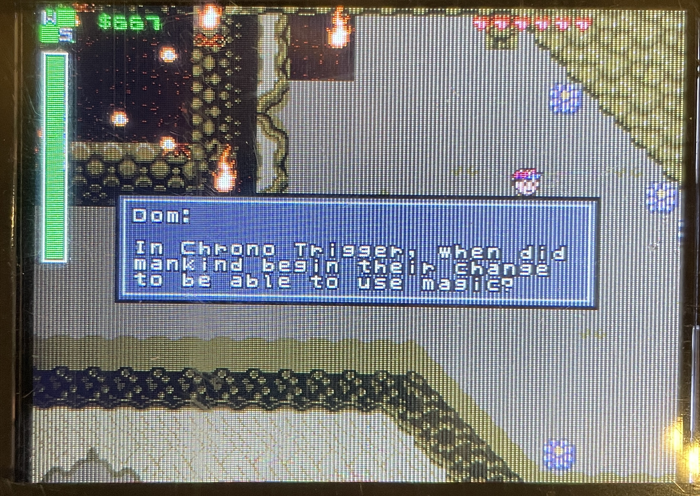

**FCC Violation**
> 100 Points - Intercept a staff radio comms check
 Once you obtain a Goon badge this would occasionally popup on screen. You also had the ability to send to all goons. 

 

`flag[COMMS_CHECK]`

**Forgotten Realms 1**
> 100 Points - In a mystical land called N-V-S

`FLAG[DUMP5_L1K3_4_TRUCK]`

**Forgotten Realms 2**
> 100 Points - I heard that the firmware can be... stringy

`FLAG[D1D_Y0U_US3_STR1NGS]`

 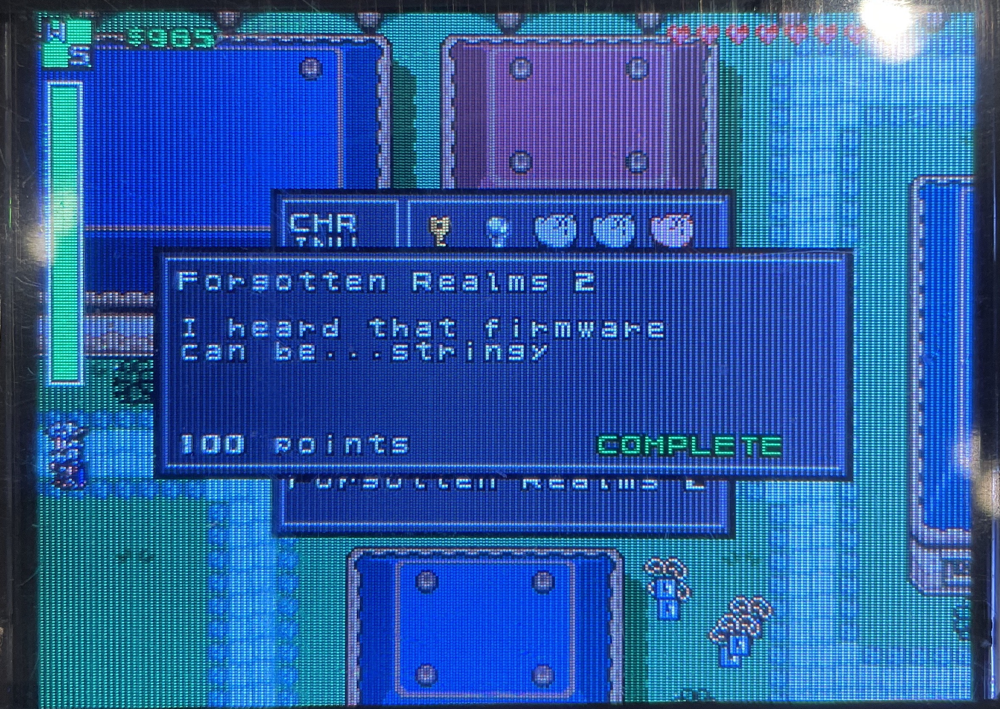

**Uncharted Territory**
> 300 Points - The scenic view of the lake hides an underwater secret

**Dig Dug Champion**
> 250 Points - You'll need a shovel to find this flag

In the Dev Logs there was a `town_dig.txt` file. 
> 2 13 23 28 30 34 47 63 89


**Save the Princess**
> 100 Points - Defeat the boss in the Eastern Castle

The second boss

**Bombtastic**
> 300 Points - Defeature JBOSS, the boss of the Swamp Dungeon

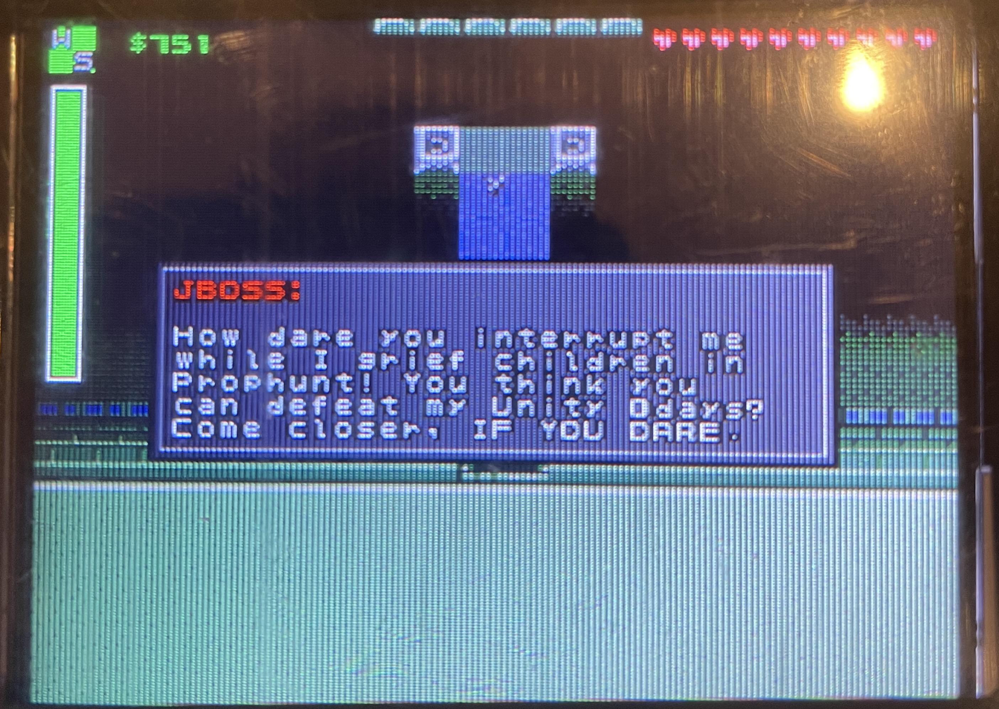

**Ya Look Dusty**
> 300 Points - Defeat the boss of the Desert Palace 

**My Kinda Job**
> 300 Points - Defeat the wandering ronin, Joesan of Roznero

**Thats Cool Man**
> 750 Points - Defeat the bosses of the Archmage's Tower

**Range is Clear**
> 200 Points - Comeplete Deviant's Firewarms Safety Course at the Shoot

**MLG Professional**
> 300 Points - Beat Amarok in the footrace 

**Rigged Deck**
> 400 Points - Beat cesio at his own game


**Spannungsbogen**
> 150 Points - Become one with the desert

An invisible maze in the western part of the map. 

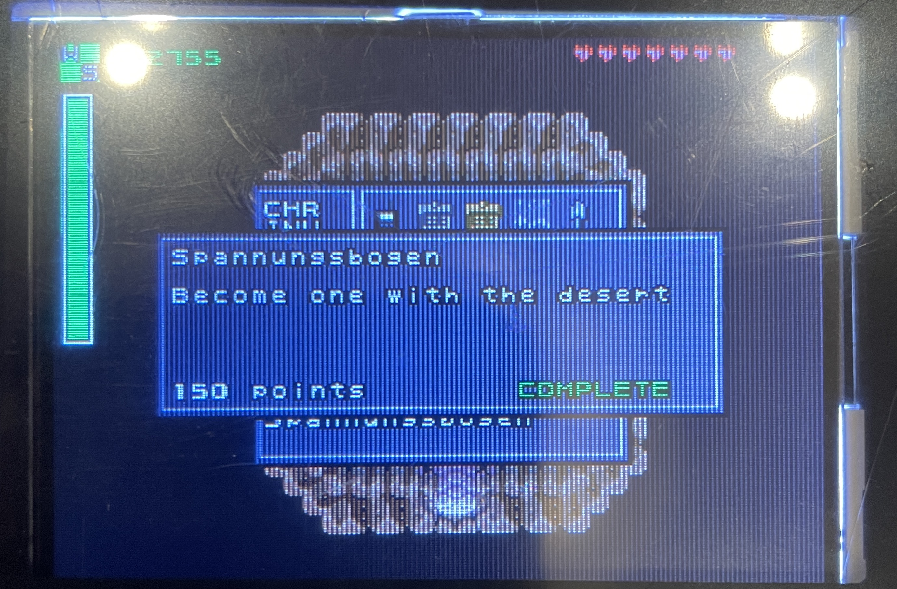

**Leap of Faith**
> 300 Points - Complete the Leap of Faith in the Mountians

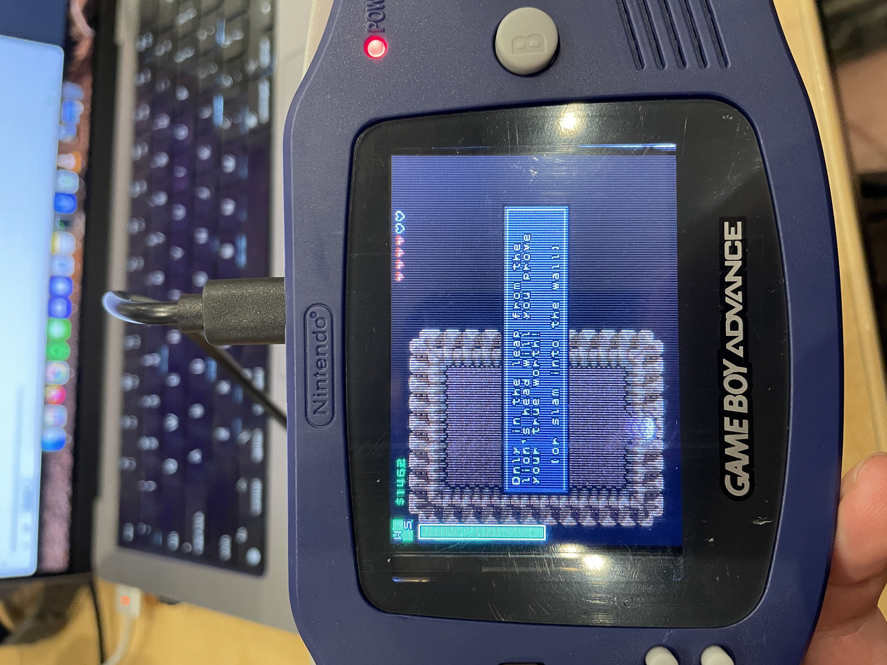

**Impossible TASk**
> 250 Points - Complete the Spike Maze in the Archmage Tower

**Impossible Hallway**
> 150 Points - Complete the Endless Hallway in the Archmage Tower

**Excavator**
> 500 Points - You might need a dumptrunk to find this big flag in the dirtiest map of all

**Badge Life**
> 250 Points - There is a flag on your L1 Badge. The literal badge, NOT the in-game one.

This was part of CharlieX's button badge. 

**Black Magic**
> 100 Points - There is a flag in the MFP Demo Party Entry. In real life (Shh, it's ok) 

Thanks DG for this freebie.

`flag[d3m0_d33z_fl4gs]`

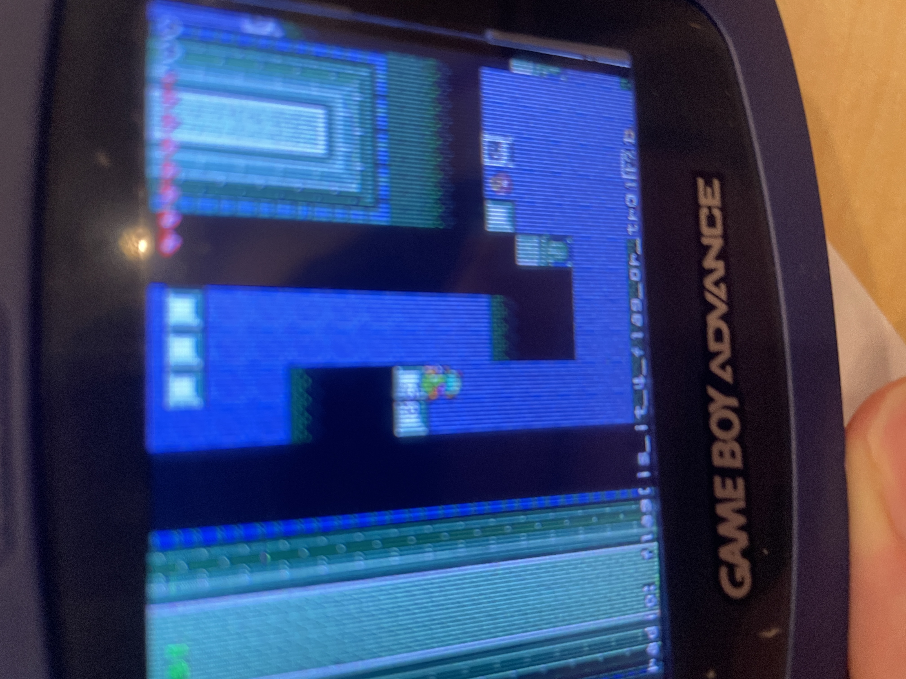