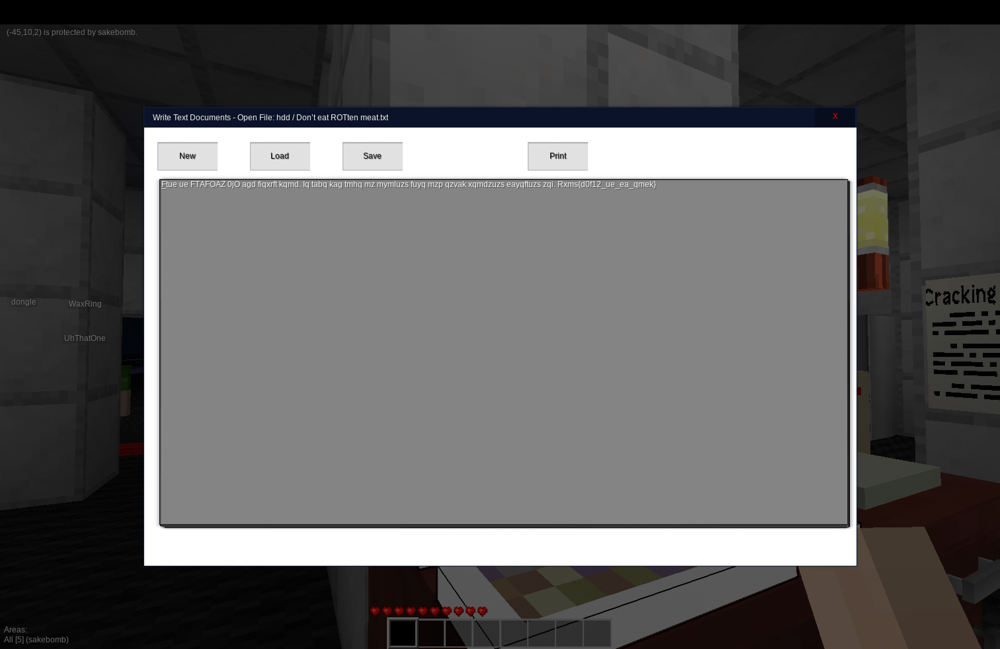
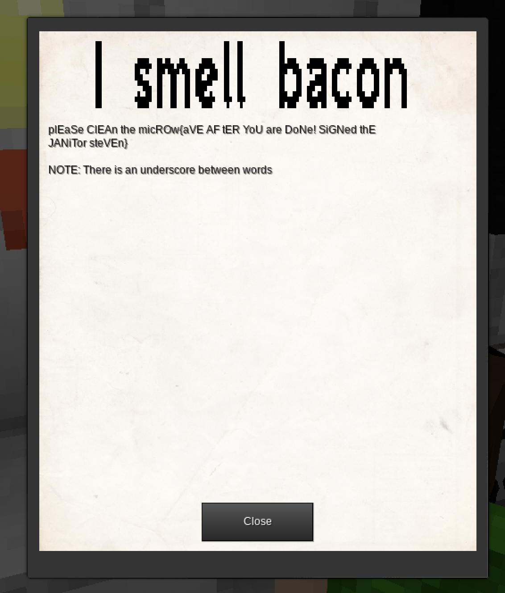

# This year's [THOTCON](https://www.thotcon.org/) CTF Challenge

[Sakebomb](https://twitter.com/Sakebomb) and THOTCON introduce this year's Digerati's Atlas as Sigma Echo. This year's challenge built out into three different parts. The badge, The physical world and the game. The game being a different take on CTF's being the world and challenges were for you to find in a "Minecraft" style world build in [Minetest](https://www.minetest.net/) 

The website portal was posted to a very bare-bones website on a private WIFI AP only accessible through via the village room. http://sigmaecho.io/challenges

Challenge 1 through 16 were posted the first day and 17 on were posted the second day. This is a breakdown of all the challenges and their flags along with explanations if necessary. 

This year, the team was split between [nsec](https://nsec.io/) and THOTCON and so us that came to Chicago played. [grim0us](https://twitter.com/grim0us), [@noonker](https://noonker.github.io/), 7im3Crisys, and myself.


**Challenge 1**
>Find the flag in the text string: f33_qn_E0G

Rot13: `flag{s33_da_R0T]`


**Challenge 2**
>Find the flag hidden in this text: 01100010010_01001310011101100_00001400010001100_0101000101010111
>
This challenge had us scratching our heads for a bit till noonker was able to piece things together. 

It can't be binary because of the 3 and 4 in the string and the \_'s throw you off unless you look at it and break it down into segments of binary and non-binary separators.

```
01100 0 10010_01001 3 10011 1 01100_00001 4 00010 0 01100_01010 0 01010 10111

N     0 T    _K     3 U/V   1 N    _B     4 C     0 N    _L     0 L     Z
```

`flag{n0t_k3v1n_b4c0n_l0lz}`


**Challenge 3**
>"In the hands of an allied spy, you've found a small piece of paper with a strange sequence of characters: 'RmxhZ3tiYXNlNjRfaXNfZWFzeX0='. What could it mean?"

`Flag{base64_is_easy}`

## Raido Challenges

**Challenge 4**
>Element: Physical
>location: Minetest in the Radio Tower
>Description: I hear music playing but I cannot get over these dots

The first of the radio challenges. 


`flag{m0rs3c0d3}`


**Challenge 5**
>Element: Physical
>Location: Minetest in the Radio Tower
>Description: Numbers Station


_A posting on the Minetest server_
>FM 99.1
>Description: Spies are all around, eXotic shOrtwave signals calling to theiR people

`47 101 67 66 30 72 100 45 109 17 75 11 85 56 43 58 80 86 84 78 33 33 58 67 20 23 93`
`49 09 22 25 65 20 55`

Preforming a XOR operation:

```python
cyphertext = [47,101,67,66,30,72,100,45,109,17,75,11,85,56,43,58,80,86,84,78,33,33,58,67,20,23,93]
key = [0x49, 0x09, 0x22, 0x25, 0x65, 0x20, 0x55]

result = []
for i in range(0, len(cyphertext)):
    result.append(chr(cyphertext[i] ^ key[i % len(key)]))
    
print("".join(result))
```

`flag{h1dd3nnumb3rs1nth3a1r}`


**Challenge 6 - Numbers Station**
>Element: Virtual
>Location: Crypto Lounge

_Never posted_

---
## Minetest Challenges
**Challenge 7 - Welcome to the crypto lounge** \[x\]
>Element: Virtual
>Location: Crypto Lounge
>)

`flag{my_f1rst_s0lut10n}`

**Challenge 8 - Don’t eat ROTten meat** \[x\]
>Element: Virtual
>Location: Crypto Lounge
>

`This is THOTCON 0xC our twelfth year. We hope you have an amazing time and enjoy learning something new.`
`flag{r0t12_is_so_easy}`

**Challenge 9 - Skip to my lou**
>Element: Virtual
>Location: Crypto Lounge, on a piece of paper in the drawer
>
>`Ykj pynih fgl iak weru tlmt utut hor dp oyu ytd? Smisu nn ia eeco ayhc sr heme. ftuo{so1o_t0_so_n0k}`


Vigenère Cipher
`flag{sk1p_t0_my_l0u}`

**Challenge 10 - Ace of Base**
>Element: Virtual
>Location: Crypto Lounge, on the sign, kitchen
>

`flag{1_saw_th3_s1gn}`

**Challenge 11 - I smell bacon**
>Element: Virtual
>Location: Crypto Lounge, second floor, kitchen
>

`flag{porky_pig}`

**Challenge 12 - Ones and Zeros**
>Element: Virtual
>Location: Crypto Lounge, second floor, paper
>

`flag{b1nary_bas1cs}`

**Challenge 13 - Cracking the Code**
>Element: Virtual
>Location: Crypto Lounge,
>
> A cryptic message, "Nzdpmphz", has found its way to you. The circumstances surrounding the receipt of this message suggest that it holds an important secret, but it appears to be encrypted. Your task is to decrypt this mystery text, which will serve as the flag.

Rot 25: `flag{mycology}`

**Challenge 14 - Cryptic Resilience**
>Element: Virtual
Location: Crypto Lounge 2nd floor

_Never posted_

**Challenge 15 - Hidden in the Open**
>Element: Virtual
Location: Crypto Lounge

_Never posted_

**Challenge 16 - The Lost Configuration**
>Element: Virtual
Location: Crypto Lounge

_Never posted_

### Day2

**Challenge 17 - A Shocking Turn**
>Element: Virtual
location: Bank
We intercepted a photo from the contact and identified this outlet: What type of outlet is it? (IE: flag{type-x})
Photo URL: http://sigmaecho.io/static/misc/plug.jpg

`flag{type-e}` 

**Challenge 18 - Lean, Mean, & Green**
>Element: Virtual
Location: Bank
We found this bank note at the scene. But we can't tell what country its from.
Photo URL: http://sigmaecho.io/static/misc/money.jpg


`flag{israel}`

**Challenge 19 - Autobahn & Cabbage Heads**
>Element: Virtual
Location: Bank
This device was intercepted in the mail. Who is its manufacturer? (IE: flag{manufacturer_name})
Photo URL: http://sigmaecho.io/static/misc/part.jpg


`flag{Hyundai}`

**Challenge 20 - Aeroespacial Awareness**
>Element: Virtual
Location: Bank
What unusual place did this plane land in 2009?
Photo URL: http://sigmaecho.io/static/misc/us_airways.jpg


`flag{hudson}` 

**Challenge 21 - Et Tu Brute?**
>Element: Virtual
Location: Bank
One of your covert operators has managed to extract the following encrypted message from an enemy mainframe: 'Iodj{F3v4u_$4o4g}'. Can you decode it?

`flag{C3s4r_$4l4d}` 

**Challenge 22 - Blaise De What??**
>Element: Virtual
Location: Bank
A cryptic string was intercepted from a secret transmission: "xpca{mifhgnke}". The keyword is suspected to be a commonly used English word. Can you reveal the flag?

`flag{vendetta}` 

## Badge Challenges

[Link to firmware](https://tc0xb.s3.us-east-2.amazonaws.com/TC_0xB.bin)

**Challenge 23 - Connected!**
>Element: Physical
Location: Badge 1

When connecting the badge to USB you were able to catch this flag on output.

UART flag: `flag{welcome_to_the_8bit_world}` X

**Challenge 24 - I Know the Code**
>Element: Physical
Location: Badge 2

When you type in the Konami Code while the badge is connected you will be put into developer mode and get this flag output. 

Hadouken! `flag{lets_fight!}` 

_Note you can also get both these flags from dumping the firmware and running strings on the bin._

**Challenge 25 - Hidden In the Midst**
>Element: Physical
Location: Badge 3

We didn't solve this flag in time, but I did want to do a breakdown of how to get this after we got a solution from the organizers at closing. 

